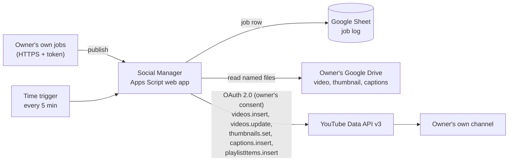
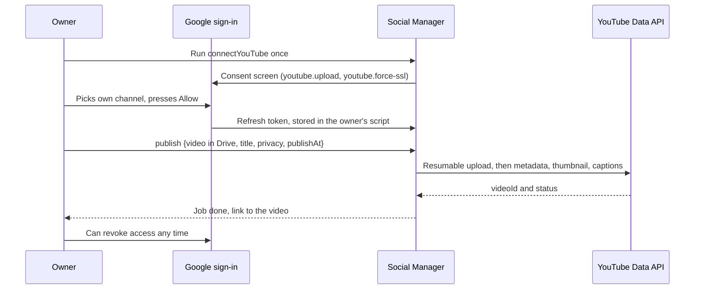

# How Social Manager works

## Architecture

```mermaid
flowchart LR
  A["Owner's own jobs<br/>(HTTPS + token)"] -->|publish| B["Social Manager<br/>Apps Script web app"]
  B -->|job row| C[("Google Sheet<br/>job log")]
  T["Time trigger<br/>every 5 min"] --> B
  B -->|read named files| D["Owner's Google Drive<br/>video, thumbnail, captions"]
  B -->|"OAuth 2.0 (owner's consent)<br/>videos.insert, videos.update,<br/>thumbnails.set, captions.insert,<br/>playlistItems.insert"| E["YouTube Data API v3"]
  E --> F["Owner's own channel"]
```

Everything runs inside the owner's Google account. No other server stores data.

## User flow

```mermaid
sequenceDiagram
  participant O as Owner
  participant G as Google sign-in
  participant S as Social Manager
  participant Y as YouTube Data API
  O->>S: Run connectYouTube once
  S->>G: Consent screen (youtube.upload, youtube.force-ssl)
  O->>G: Picks own channel, presses Allow
  G->>S: Refresh token, stored in the owner's script
  O->>S: publish {video in Drive, title, privacy, publishAt}
  S->>Y: Resumable upload, then metadata, thumbnail, captions
  Y-->>S: videoId and status
  S-->>O: Job done, link to the video
  O->>G: Can revoke access any time
```
